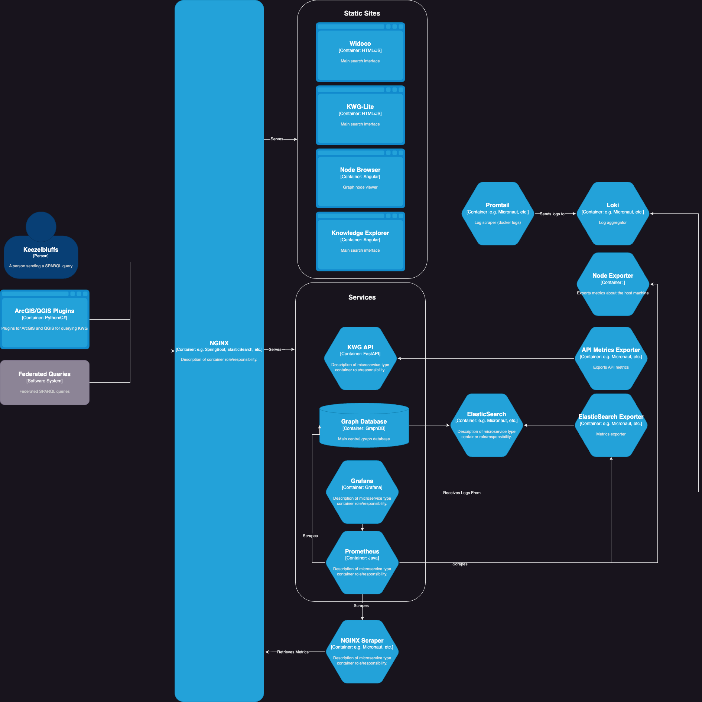

# kwg-architecture

KnowWhereGraph's networking and service architecture

## Overview

NGINX serves as the load balancer and reverse proxy to internal services. Several static sites are served directly by NGINX. These include the ontology description pages, the [faceted search](https://github.com/KnowWhereGraph/kwg-faceted-search), the Node Browser, and void description file.

### Architecture Diagram

The diagram below shows the services and static sites behind NGINX.

